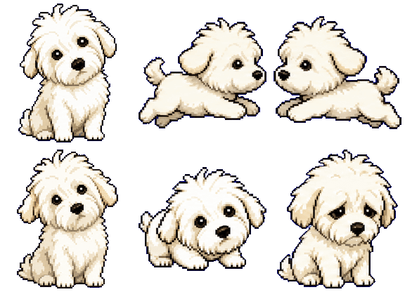

# 朵朵 (Duoduo) - Codex 桌宠

一只毛茸茸的白色小狗，陪你温暖地专注编码。



## 简介

朵朵是一只可爱的白色蓬松小狗（比熊风格），作为 [Codex](https://github.com/openai/codex) 的桌面宠物，在你编码时陪伴在屏幕一角。

## 动画展示

| 挥手 | 右跑 | 奔跑 |
|:---:|:---:|:---:|
|  |  |  |

| 空闲 | 等待 | 失败 |
|:---:|:---:|:---:|
|  |  |  |

| 审阅 | 左跑 |
|:---:|:---:|
|  |  |

## 精灵图

完整的精灵图表 (`spritesheet.webp`) 采用 Codex 官方格式：

- **尺寸**: 1536 x 1872 像素
- **网格**: 8 列 x 9 行
- **帧尺寸**: 192 x 208 像素

| 行 | 动画状态 | 说明 |
|---|---|---|
| 1 | waving | 挥手打招呼 |
| 2 | running-right | 向右奔跑 |
| 3 | running | 奔跑 |
| 4 | idle | 空闲站立 |
| 5 | waiting | 等待任务完成 |
| 6 | failed | 任务失败反应 |
| 7 | review | 审阅代码 |
| 8 | running-left | 向左奔跑 |
| 9 | (保留) | — |

## 配置文件

```json
{
  "id": "duoduo",
  "displayName": "朵朵",
  "description": "A fluffy white companion dog for warm focused work.",
  "spritesheetPath": "spritesheet.webp"
}
```

## 安装

使用petdex安装
https://petdex.crafter.run/zh/pets/duoduo
``` bash
npx petdex install duoduo
```

将 `duoduo` 文件夹复制到 Codex pets 目录：

```bash
cp -r duoduo ~/.codex/pets/
```

然后在 Codex 中使用 `/pet` 命令选择朵朵。

## License

MIT
